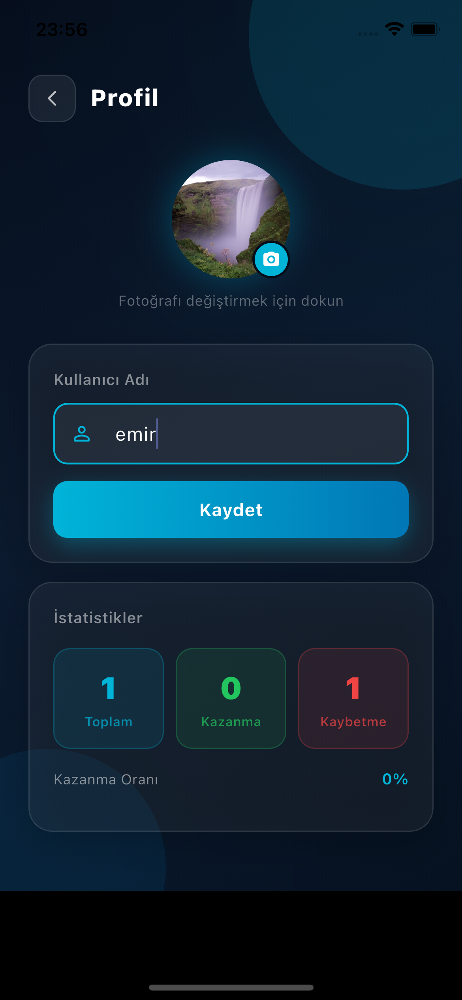
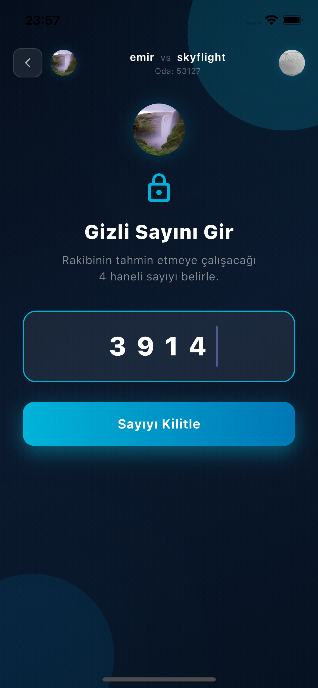
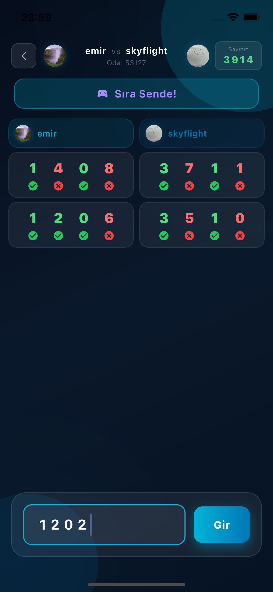
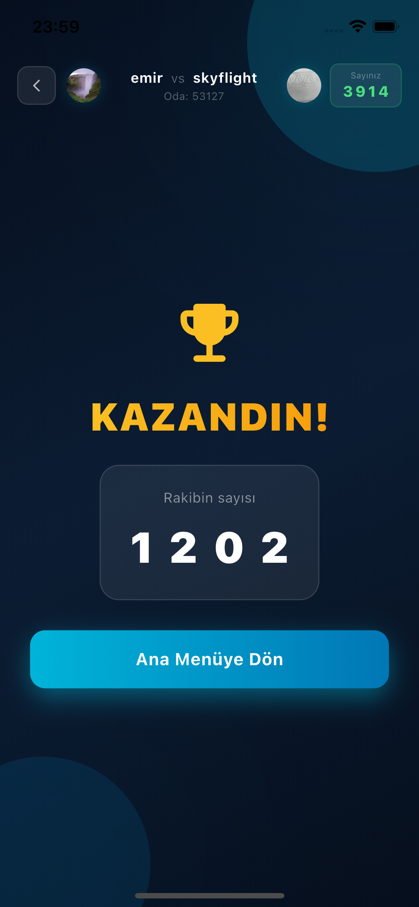

# Dörtte Dört - Online Sayı Tahmin Düellosu 

**Dortte Dort**, oyuncuların birbirlerinin tuttuğu 4 haneli gizli sayıları gerçek zamanlı olarak tahmin etmeye çalıştığı, strateji ve mantık odaklı bir mobil oyundur. **Flutter** ve **Firebase** kullanılarak geliştirilmiştir.

## 🚀 Oyunun Mantığı

Oyun, klasik "Bulls and Cows" (Boğalar ve İnekler) veya "Mastermind" mantığı üzerine kuruludur:
1. Her oyuncu oyun başında 4 haneli, rakamları birbirinden farklı bir sayı tutar.
2. Sırayla tahminler yapılır.
3. Her tahminden sonra sistem, girdiğiniz 4 rakamın her biri için ayrı ayrı geri bildirim verir:
   - ✅ **Yeşil Tik:** Rakam doğru ve yeri de doğru.
   - ❌ **Kırmızı Çarpı:** Rakam yanlış veya yeri yanlış.
4. Rakibinin sayısını ilk bulan düelloyu kazanır!

## 📸 Ekran Görüntüleri

| Profil ve Başlangıç | Oyun Ekranı | Oyun Odası | Oyun Sonu |
|:---:|:---:|:---:|:---:|
|  |  |  |  |

## 🛠 Kullanılan Teknolojiler

- **Framework:** Flutter
- **Backend:** Firebase
  - **Authentication:** Anonim veya kayıtlı kullanıcı girişi.
  - **Cloud Firestore:** Oyun odalarının yönetimi, anlık hamle takibi ve skor tablosu.
  - **Cloud Storage:** Kullanıcı profil fotoğraflarının barındırılması.

## ✨ Özellikler

- **Gerçek Zamanlı Düello:** Firebase altyapısı sayesinde rakibinizin hamlelerini anlık olarak görebilirsiniz.
- **Profil Yönetimi:** Kendi profil fotoğrafınızı yükleyebilir ve istatistiklerinizi takip edebilirsiniz.
- **Oyun Odaları:** Arkadaşlarınızla veya rastgele rakiplerle oynamak için oda sistemi.
- **Akıllı Geri Bildirim:** Tahminleriniz için detaylı analiz sistemi.

## ⚙️ Kurulum

Projeyi yerelinizde çalıştırmak için:

1. Bu depoyu klonlayın:
   ```bash
   git clone [https://github.com/mustafaemirata/Dortte-Dort.git](https://github.com/mustafaemirata/Dortte-Dort.git)
